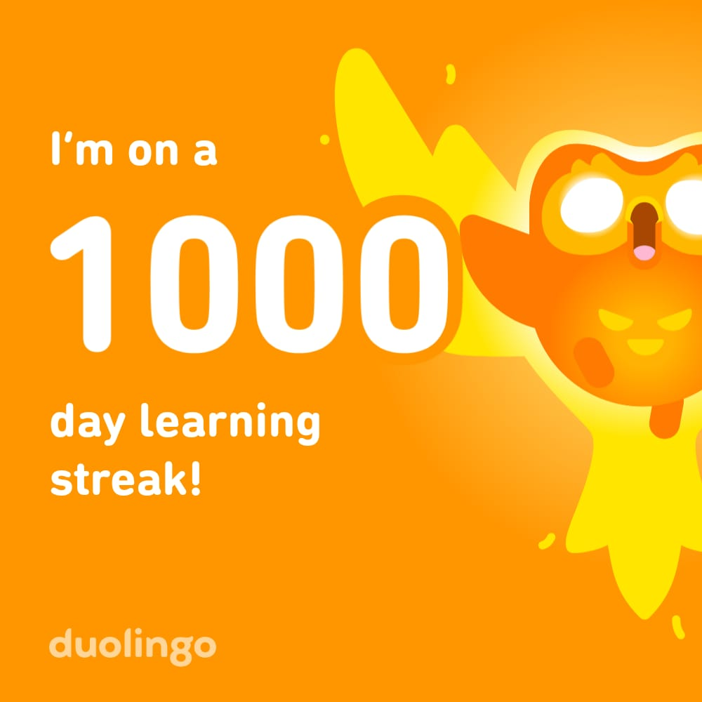

    

        
 { 2024-11-06 }

        
 

        

            <h3><b>Imagine Foundation - Graduation Certification</b></h3>
            
            
I recently graduated from Imagine’s Job Booster program — and what a journey it's been. 

            
In just a few focused weeks, I practiced showing up as both a technologist and a communicator. I learned how to align my technical skills with the expectations of the European job market, how to tell my story clearly, and how to position myself for the opportunities I want to create. 

            
What stood out most wasn’t just the career coaching or the improved LinkedIn profile — it was the people. The support from the Imagine team, the honest feedback from my coach, and the motivation that came from being part of a diverse, driven cohort. 

            
I'm honored to have graduated in the top 10% of my group and excited to continue this path as part of the upcoming Imagine Fellowship. 
 
            
This is a small milestone, but an important one. Here's to building bridges, not borders.

        

    

    

        
{ 2025-04-11 }

        
 

        

            <h3><b>CBS Swap Project - Asiacell</b></h3>
            
            
After having participated in the Huawei CBS project as a vendor for 7 months; I moved to operator and had a positive participation in the CBS swap project based on the 8 years of experience in the Telecom industry.

            
A thankful message from management to the active participation in the successful CBS swap project.

        

    

    

        
{ 2025-04-11 }

        
 

        

            <h3><b>Huawei CBS Operational Training</b></h3>
            
            
The training was hands-on expereience on the Huawei containerized CBS solution from business configuration to product release and testing. We got introduced to various CBS modules and the general functionality of the system.

        

    

    

        
{ 2025-04-30 }

        

        

            <h3><b>[Badge] - Duolingo 1000 day streak </b> </h3>
            
                
I would like to highlight my perseverance in learning the German language.

        

    

    

        
{ 2025-04-09 }

        

        

            <h3><b>[Participation] Future Literacy Participation</b></h3>
            
            

        

    

   

    
 

    
{ 2025-03-25 }

    

        <h3><b>[Certificate] Kakfa Certs</b></h3>
        
        
I completed the "Apache Kafka Essential Training: Getting Started" course by Kumaran Ponnambalam. This dense yet highly informative course lays a solid foundation in Kafka, covering topics like producers, consumers, partitions, consumer groups, and offset management.

        
But here’s the real takeaway: <strong>No course alone is enough</strong> — pairing it with <strong>hands-on labs</strong> in a home setup makes all the difference!

        
By deploying Kafka in my home lab, tweaking configurations, and testing real-world scenarios, I gained a deeper, practical understanding of:

        <ul>
        <li><strong>Kafka’s core concepts</strong> – message streams, partitions, and offsets</li>
        <li><strong>Cluster setup & broker configurations</strong></li>
        <li><strong>Real-time data streaming use cases</strong> – logging, analytics, and monitoring</li>
        </ul>
        
Courses provide knowledge, but <strong>hands-on practice bridges the gap between theory and real-world implementation.</strong>

        
If you're diving into Kafka, set up a home lab — it’s a game changer! Start with this informative course.

    

    

  

